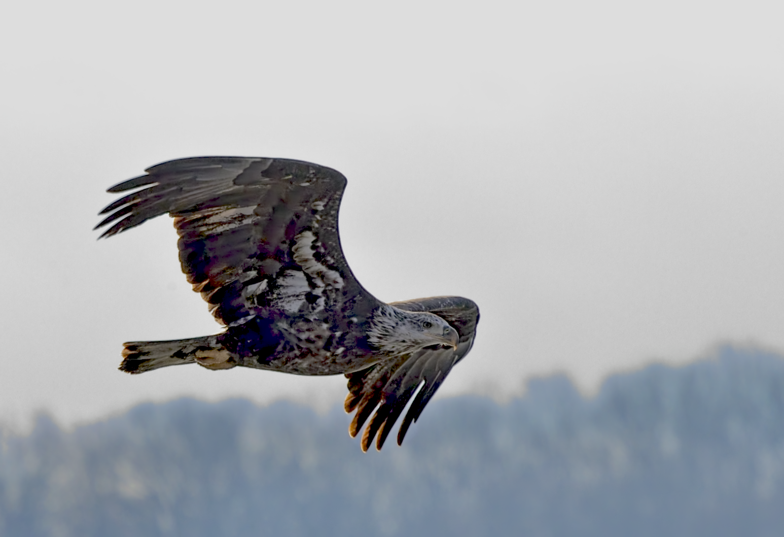
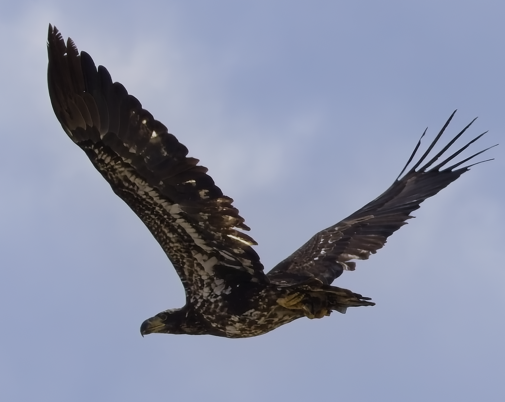
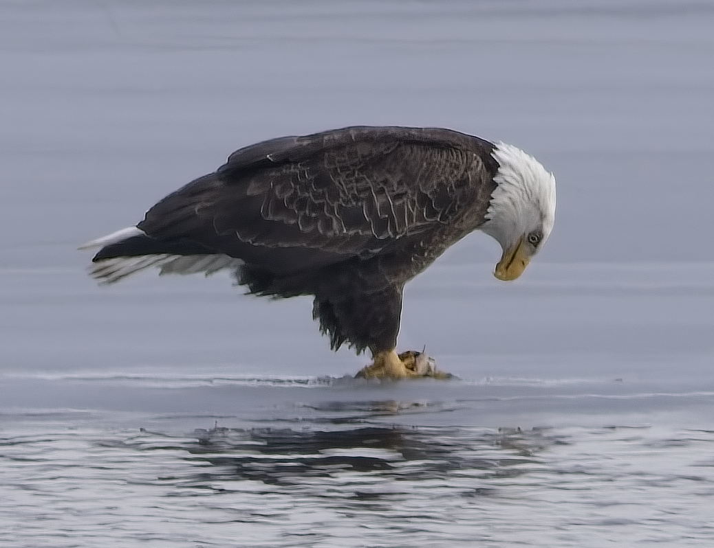
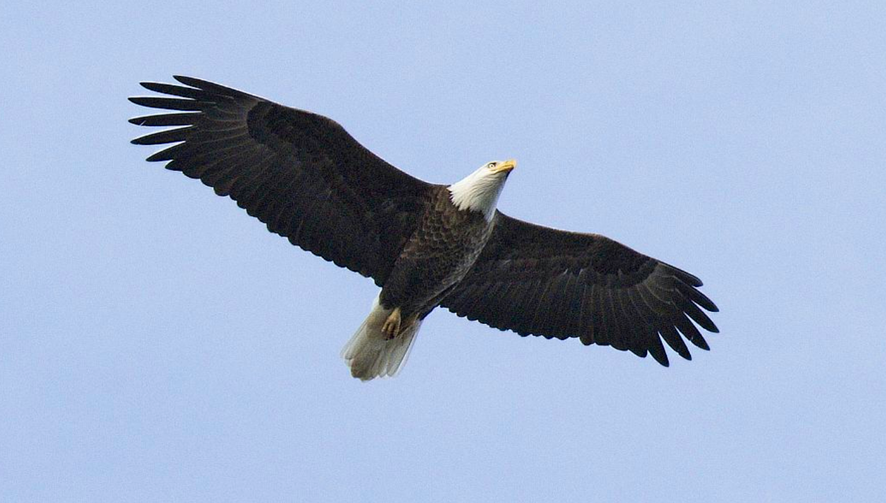

# Identifying Age

To help monitors accurately document sightings in the field, this guide provides a breakdown of plumage stages and behavioral cues for Bald Eagles.

A comprehensive chart with detailed explanations is available at [Avian Report](https://avianreport.com/age-and-identify-a-juvenile-and-sub-adult-bald-eagle/).

## First Year

First-year juveniles are the easiest to identify due to their consistent dark coloring.

- **Plumage:** Almost entirely dark chocolate brown.
- **Head & Eye:** Dark brown eyes and a solid black/gray beak.
- **Wing Shape:** Uniformly dark with minimal mottling.

## Second Year

Second-year eagles (roughly 1.5 to 2.5 years old) enter a "messy" transition phase.

- **The "Messy" Mottling:** Extensive "salt and pepper" white mottling across the underwings, belly, and back. This "tortoiseshell" look is a hallmark of the second year.
- **The Head & Eye:** The head begins to lighten but often retains a dark "eyestripe" (similar to an Osprey). The eye transitions from dark brown toward pale yellow.
- **The Beak:** The beak begins to lighten at the base, transitioning from black to a dusky yellow/tan.
- **Wing Shape:** The trailing edge of the wings may look uneven or "saw-toothed" as the bird molts juvenile feathers for adult-like feathers.

## Third Year

Third-year eagles continue the transition toward adult plumage, becoming cleaner but still "dirty" in appearance.

- **Plumage:** The white mottling becomes more pronounced, and the "belly band" becomes more distinct.
- **The Head:** The head starts to whiten significantly but remains streaked or "dirty" with brown feathers.
- **The Beak:** The beak continues its transition to yellow.

## Near-Adult (4th or 5th Year)

Birds in this stage are nearly indistinguishable from adults at a distance.

- **Head & Tail:** The head is mostly white, though faint brown flecking or "smudging" may still be visible upon close inspection.
- **Beak:** The beak is now a solid, vibrant yellow.
- **Eyes:** The eyes have turned to the piercing pale yellow of an adult.

## Adult (5+ Years)

Full adults have achieved their definitive plumage.

- **Head & Tail:** Iconic, crisp white head and tail with no remaining brown flecks.
- **Beak:** Bright, solid yellow.
- **Eyes:** The iris is completely pale yellow.

## Identifying the Adults

While male and female Bald Eagles look identical in plumage, there are subtle physical and behavioral differences.

- **Size (Dimorphism):** Females are roughly **25% larger** than males. If both are on the nest together, the female will appear significantly bulkier.
- **The Hallux (Rear Claw):** In females, the hallux is often longer (over 1 inch) compared to the male.
- **Voice:** Males typically have a higher-pitched, thinner "squeal," while females have a slightly deeper, harsher "cackle."

## Juvenile Plumage Stages

Eaglets change dramatically over their first 12 weeks. Use these visual markers for the **Nestling Status** column:

- **Weeks 1–2 (Neonatal):** Covered in light grey "natal down." Wobbly and unable to lift heads.
- **Weeks 3–5 (Thermal Down):** Thicker, darker grey down. They begin "scooting" around the nest on their hocks.
- **Weeks 6–9 (Pin Feathers):** Dark brown feathers replace the down, creating a "shaggy" or mottled appearance.
- **Weeks 10–12 (Pre-Fledging):** Fully feathered in dark brown/black. They begin "branching" (hopping to nearby limbs) and flapping vigorously.

## Adult vs. Immature Summary

If you see eagles near the nest without white heads, they are sub-adults. It takes approximately **5 years** to reach full adult plumage.

| Age | Primary Characteristics |
|:--------------------|:--------------------------------------------------|
| **Year 1** | Almost entirely dark brown; dark beak and dark eyes. |
| **Year 2** | "Mottled" look; white belly and underwing coverts; "Osprey-like" eye stripe. |
| **Year 3** | Head starts to whiten but remains "dirty" or streaked; beak begins turning yellow. |
| **Year 4** | Head is mostly white with a few dark spots; tail has a dark terminal band. |
| **Year 5+** | Clean white head/tail; bright yellow beak; pale yellow iris. |

## Distinguishing from Other Birds

In the field, use these silhouette cues to avoid misidentifying eagles from a distance.

### Bald Eagle

- **Wing shape:** Flat and straight—like long planks.
- **Overall look:** Big, bulky body with broad wings.
- **Flight style:** Steady soaring, minimal wobble.

!!! tip "Memory Trick"
    Think of the Bald Eagle as a **"Flying Barn Door."**

### Turkey Vulture

- **Wing shape:** Noticeable **V-shape (dihedral)**.
- **Flight style:** Wobbly, teetering side-to-side; often tilts while riding thermals.

!!! tip "Memory Trick"
    Think of the Turkey Vulture as a **"Drunken Teetering V."**

### Osprey

- **Wing shape:** Distinct **M-shape** (kinked at the wrists/carpals).
- **Overall look:** Slimmer than an eagle with longer wings.
- **Flight style:** More active—alternates between flapping and gliding.

!!! tip "Memory Trick"
    Think of the Osprey as **"M for fish-hunter."**