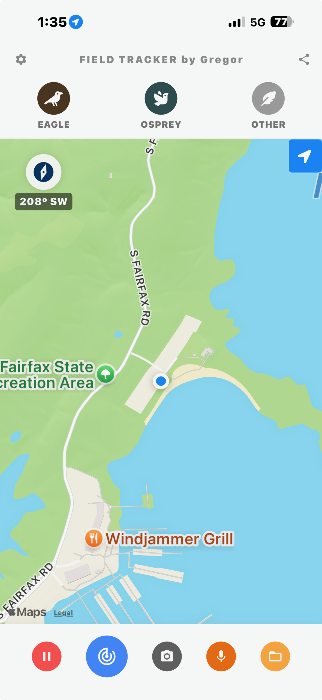
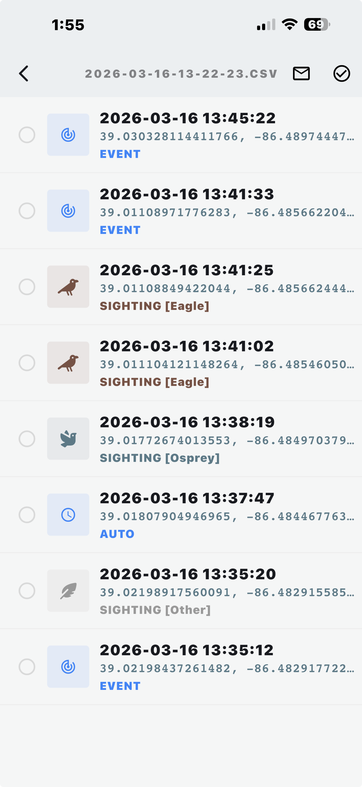

# Field Monitoring Application

While traditional manual logging is a reliable method for wildlife observation, it is often impractical in challenging field conditions. On a kayak, for example, paper logs are susceptible to water damage and cumbersome to manage. To address these challenges, a custom mobile tracking tool was developed specifically for the monitoring of eagles and ospreys.

## Motivation and Development

The primary objective of this application is to transition from manual data entry to a system of "passive" data collection. By automating the recording of GPS coordinates, timestamps, and compass bearings, the observer can remain focused on the subject rather than the logistics of documentation.

This approach provides three primary advantages: - **Precision:** Minimizes human error in recording coordinates and bearings. - **Efficiency:** Consolidates event logging, path tracking, and data reporting into a single mobile interface. - **Analytical Potential:** Establishes a foundation for long-term spatial analysis, such as nesting heatmaps and activity frequency.

## Key Technical Innovations

Unlike general-purpose birding apps, this tool includes specialized modules designed for the needs of dedicated field researchers.

### Automated Triangulation

The application includes a mathematical module that calculates the intersection point of two distinct observations. This is particularly useful for pinpointing nest locations in difficult terrain or over water where direct access is restricted. This allows researchers to obtain accurate nest locations while strictly adhering to the 100m distance rules.

### "Safety Zone" Geofencing

To simplify distance management, the app features a definable geofence. Users can set a radius around sensitive locations (such as known nests), and the app will display a visual boundary to ensure the observer does not inadvertently enter a restricted zone.

!!! tip "Unique Value Proposition"
    Most wildlife apps log the **observer's location**. This tool logs the **observer's location AND the compass heading** toward the bird, enabling true spatial mapping and triangulation of the subject's actual position.

## Interface and User Guide

The application is designed for "one-tap" operation to minimize distraction during sightings.

### The Map Interface

Upon launch, the application opens to the map screen, which displays the user's current GPS location and a real-time compass.

- **Path Tracking:** Tapping the path icon toggles the display of the recorded travel path, allowing the user to review their route.
- **Event Logging:** The top of the screen features quick-access buttons for specific sightings (Eagles, Ospreys, and other birds).
- **Action Bar:** The bottom menu provides controls to start monitoring, log a general event, capture a photo, or record audio.

### The Table View and Data Management

The table view provides a structured overview of all captured events.

- **Event Management:** Users can select individual or multiple events for deletion.
- **Triangulation Trigger:** When two events are selected, the app can calculate and create a new event at the intersection of their recorded bearings.
- **Reporting:** The mail icon generates a structured report (CSV/HTML) and sends it to the registered email address.

### Configuration

A settings menu (accessible via the cog icon) allows users to configure their identity, email, and the interval for automated GPS recording. This automated interval ensures a precise path is recorded even when manual events are not being triggered.

## Development Lifecycle and Distribution

### Current Status and Release

The application is currently a functional prototype distributed via developer mode, requiring a direct USB upload to the device. Transitioning to a formal production release involves several milestones:

- **Store Registration:** Registration with the Apple App Store (requiring an annual fee).
- **Sponsorship:** As the app is intended for free distribution, store fees and taxes would require financial sponsorship.
- **Platform Expansion:** While currently implemented for iOS, the cross-platform framework allows for future deployment to Android devices.

### Future Roadmap

Planned enhancements include: - **Historical Heatmaps:** Aggregating seasonal data to visualize high-traffic zones and hunting grounds. - **Automated Visual Alerts:** Pre-loading known sensitive locations to trigger alarms as the user approaches. - **EXIF Integration:** Optionally merging GPS and timestamp data into external camera images, with a built-in "privacy scrub" to remove coordinates before public sharing. - **Behavioral Logging:** Adding specific buttons for anticipated behaviors as requested by DNR volunteer watchers. - **Report Automation:** Generating templates that can be directly used to fill out official online watcher reports.

## Competitive Analysis

Existing mobile tools typically focus on either AI-driven identification or general citizen science. This application occupies a unique niche by focusing on tactical field research.

### Comparison of Monitoring Applications

| Application | Primary Purpose | Key Features | Data Export |
|:---------------|:---------------|:-----------------------|:---------------|
| **eBird** | Population tracking | Global database, automated checklists. | CSV/Web |
| **Merlin Bird ID** | Identification | AI Sound and Photo ID. | eBird Sync |
| **NestWatch** | Nest monitoring | Tracks eggs, hatching, and fledging. | Cornell Lab Sync |
| **iNaturalist** | Biodiversity logging | Community verification, AI ID. | Open-source (GBIF) |
| **This Tool** | **Tactical Monitoring** | **Compass headings, Triangulation, Geofencing.** | **Local CSV/HTML** |

### Strategic Advantages

- **Tactical Precision:** By logging the compass heading, the tool maps the *subject*, not just the *observer*.
- **Mathematical Integration:** Automated triangulation brings GIS-level capabilities to a consumer mobile device.
- **Operational Simplicity:** The "one-tap" philosophy is optimized for cold-weather or kayak-based monitoring where complex menus are impractical.

## Data Privacy and Security Protocols

The collection of high-precision geospatial data requires a rigorous approach to protect both the researcher and the avian subjects.

- **Local-First Architecture:** All observations, GPS paths, and multimedia are stored locally on the device. No data is transmitted to a centralized server.
- **User-Initiated Export:** Data is only transmitted when the user explicitly triggers the "Mail" function to a single registered address.
- **Nesting Site Confidentiality:** To prevent unauthorized human disturbance, the app does not sync with public databases.
- **On-Device Processing:** All triangulation and geofencing calculations are performed locally.
- **Minimal Permissions:** The app requests access only to the GPS, Camera, Microphone, and local File System.