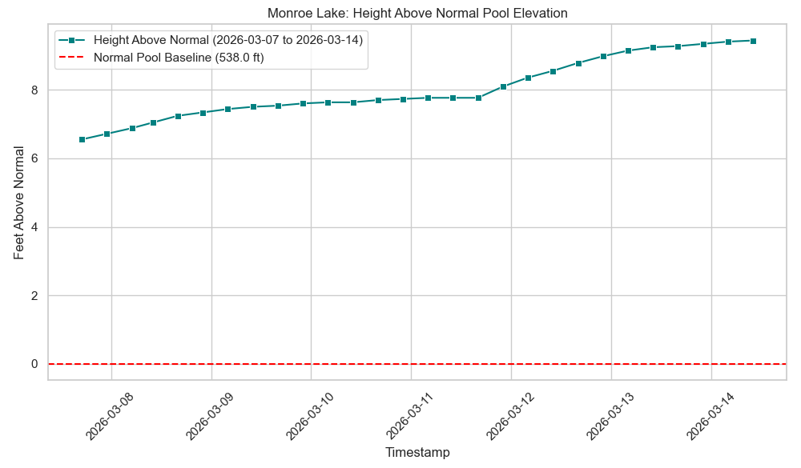
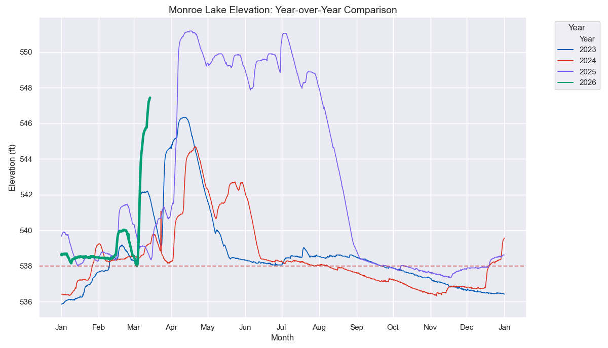
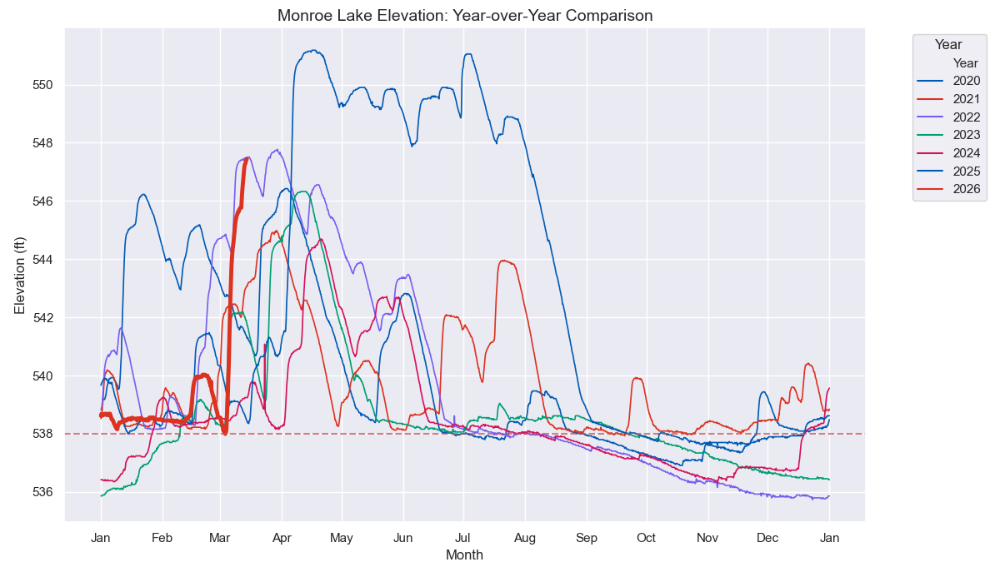

# Lake Level

The data is obtained from the Corps of engineers: <https://water.usace.army.mil/overview/lrl/locations/monroe> 

Last updated 2024-03-14

## Short term period

## Yearly comparison 2023 - 2026

**Green is 2026**

## Yearly comparison 2020 - 2026

**Red is 2026**

