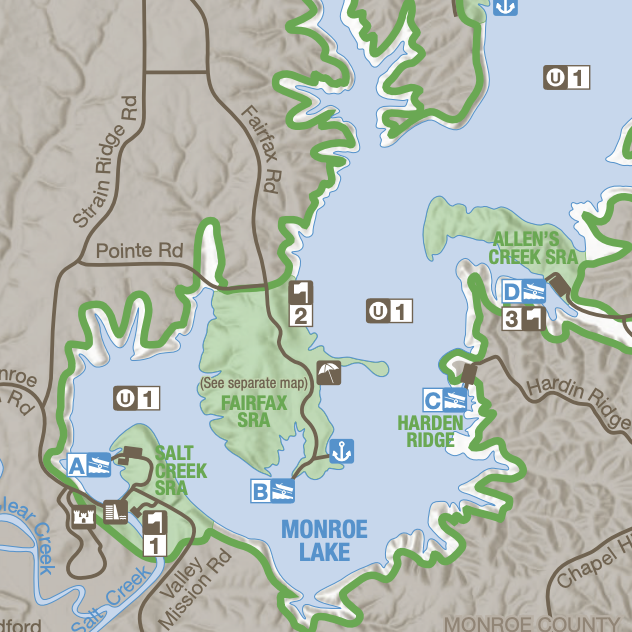
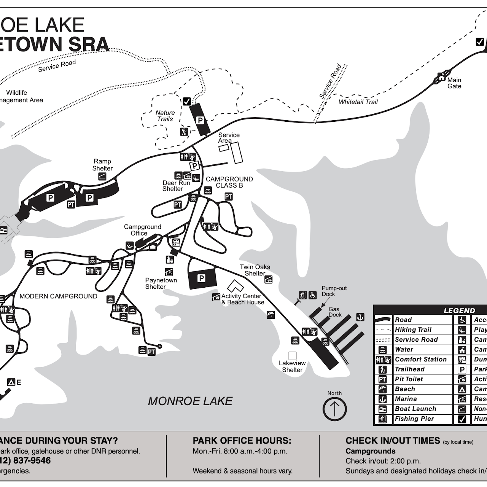
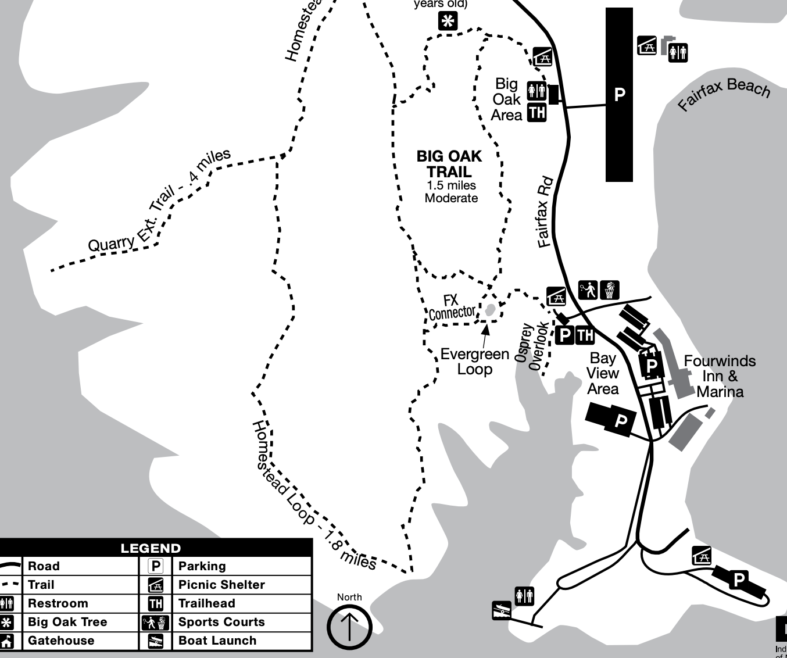
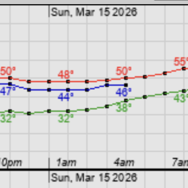
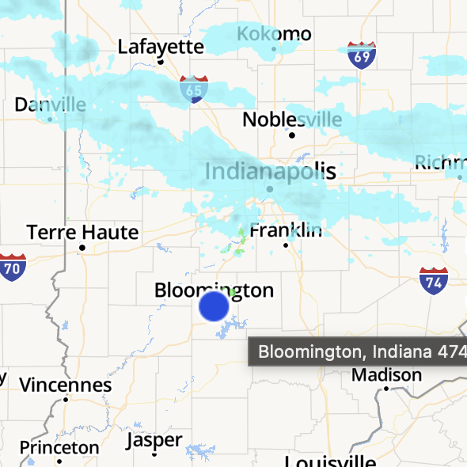
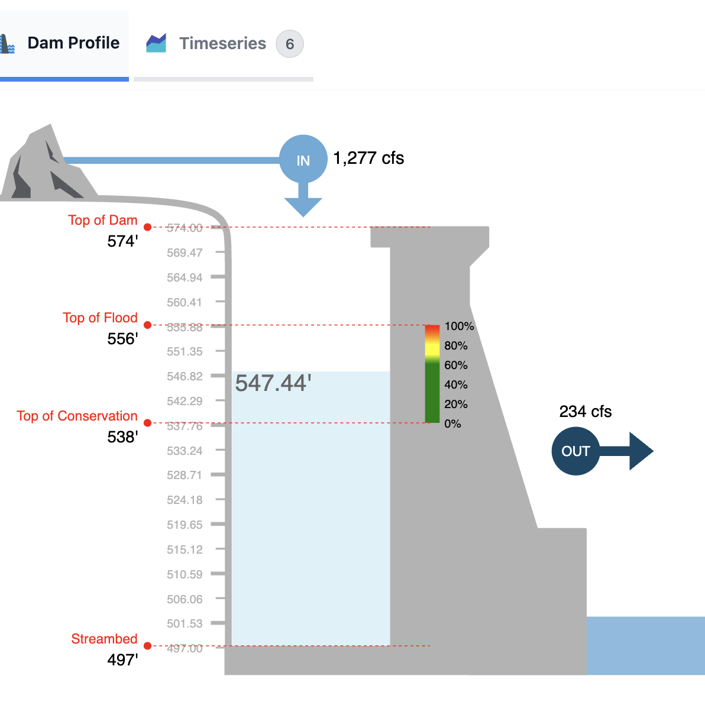
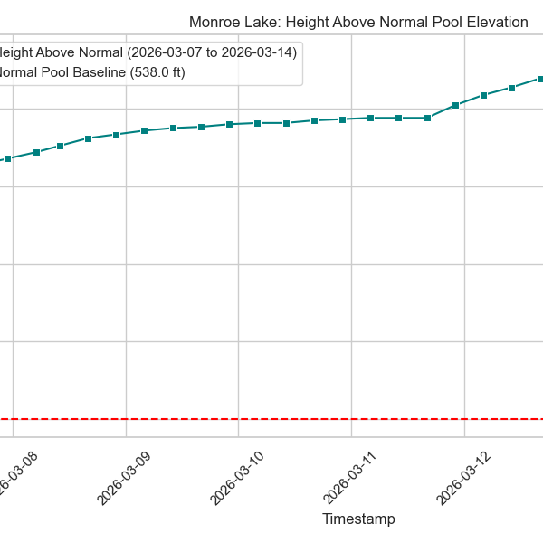
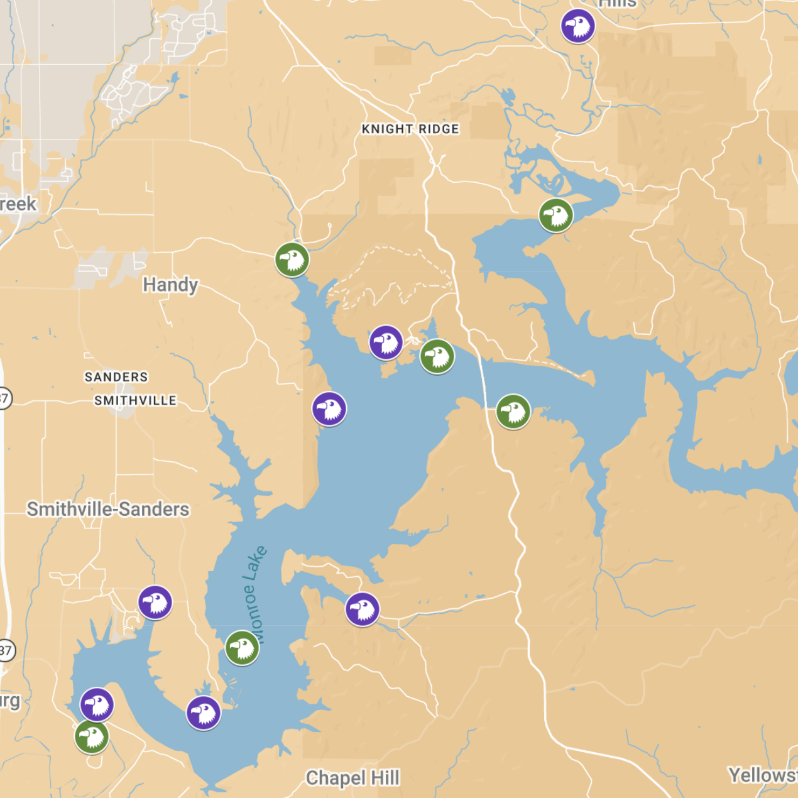
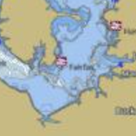

# Maps

## General Maps

  
  

    <a href="https://www.in.gov/dnr/state-parks/files/monroe_trail.pdf">Official DNR PDF</a>
    <a href="https://ebird.org/hotspot/L295799">eBird - Lake Monroe</a>
    <a href="https://ebird.org/hotspot/L341052">eBird - Dam</a>
    <a href="https://ebird.org/hotspot/L501650">eBird - Pointe</a>
  

  
  

    <a href="https://www.in.gov/dnr/state-parks/files/paynetown_state_recreation.pdf">Official DNR PDF</a>
    <a href="https://ebird.org/hotspot/L294929">eBird - SRA</a>
    <a href="https://ebird.org/hotspot/L1803845">eBird - Marina</a>
  

  
  

    <a href="https://www.in.gov/dnr/state-parks/files/monroe_hiking_trail.pdf">Official DNR PDF</a>
    <a href="https://ebird.org/hotspot/L315008">eBird</a>
  

## Weather & Lake Levels

  
  

    <a href="https://forecast.weather.gov/MapClick.php?lat=39.1609&lon=-86.5231&unit=0&lg=english&FcstType=graphical">NWS Hourly Weather Forecast</a>
  

  
  

    <a href="https://weather.com/weather/radar/interactive/l/519eb2187a20d9722e46258dcc72cfaaed6c19185b4aad6a1277025545a53d84">The Weather Channel Radar Map</a>
  

  
  

    <a href="https://water.noaa.gov/gauges/MONI3">NOAA Lake Level Portal</a>
    <a href="https://water.usace.army.mil/overview/lrl/locations/monroe#:~:text=Monroe%20Lake%20is%20located%20in,in%20the%20last%2024%20hours.">Army Corps of Engineers Overview</a>
    <a href="https://water.usace.army.mil/map/lrl?s=eyJ0IjoicCIsInByb3ZpZGVyL3NsdWciOiJMUkwiLCJsb2NhdGlvbl9zbHVnIjoibW9ucm9lIiwieCI6LTg2LjUxMjUsInkiOjM5LjAwNzQ5OTk5OTk5OTk5fQ%3D%3D">USACE Map View</a>
  

  
  

    <a href="https://sites.google.com/view/monroe-lake-eagle-watch/lake-level">Lake Level Plot (Generated by Gregor)</a>
  

## Specialized Maps

  
  

    <a href="https://www.google.com/maps/d/viewer?mid=1Zivpq9_UdxRN1z-EpNleJJixOkc-8Y0q&ll=39.074926628527116%2C-86.45342445000001&z=12">DNR Google Map View</a>
  

  
  

    <a href="https://www.gpsnauticalcharts.com/main/nautical-chart/us_aa_in_00451234-monroe-lake-nautical-chart.html">Commercial Nautical Chart (HTML)</a>
  

